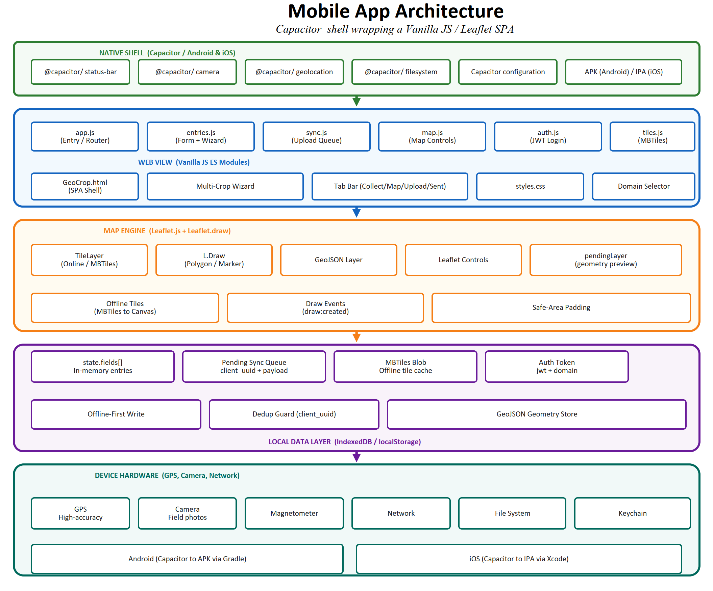
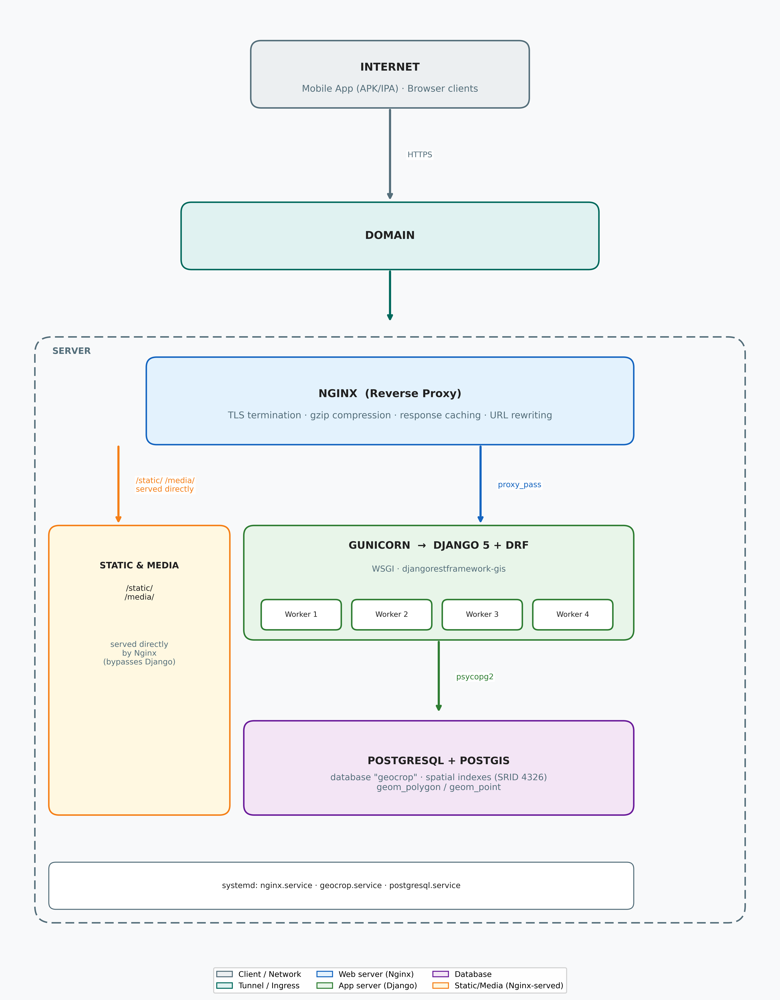

# Geo-Crop Collector

An offline-first geospatial crop field data collection platform built for national-scale agricultural monitoring. Designed for field officers operating in areas with intermittent connectivity, the system captures crop type, geometry (polygon or point), growth stage, and agronomic attributes per field, then synchronises to a central PostGIS database when connectivity is restored.

Developed at the **Zimbabwe National Geospatial and Space Agency (ZINGSA)**.

---

## System Architecture

| Diagram | Description |
|---|---|
|  | Mobile app layer stack |
|  | Offline sync protocol (push-then-pull, UUID deduplication) |
|  | Production deployment topology |

---

## Technology Stack

| Component | Technology |
|---|---|
| Backend API | Django 5 + Django REST Framework + djangorestframework-gis |
| Spatial database | PostgreSQL 14+ with PostGIS extension |
| Frontend | Vanilla JavaScript ES modules, Leaflet.js, Leaflet.draw |
| Mobile shell | Capacitor 8 (Android APK, iOS IPA) |
| Web server | Nginx (reverse proxy, TLS, gzip, static files) |
| App server | Gunicorn (WSGI, multi-worker) |
| Authentication | JWT (djangorestframework-simplejwt) |
| Offline maps | MBTiles (SQLite tile store, served via custom Capacitor plugin) |

---

## Repository Structure

```
geo-crop-collector/
├── backend/                   Django project
│   ├── apps/
│   │   ├── accounts/          User model, JWT auth, role management
│   │   ├── fields/            FieldEntry, Survey, Photo, Validation models
│   │   ├── mbtiles/           MBTiles upload, tile serving, overlay management
│   │   └── sync/              Sync API endpoints and tests
│   ├── geo_crop/              Django settings, URLs, WSGI
│   ├── templates/             Admin customisation, dashboard
│   ├── requirements.txt
│   └── .env.example           Environment variable template
├── frontend/
│   ├── app/                   Web SPA (HTML + CSS + JS source)
│   │   ├── GeoCrop.html       Main application shell
│   │   ├── signin.html        Login / domain selection
│   │   └── src/
│   │       ├── js/            ES modules (app, entries, map, sync, auth …)
│   │       └── css/           Styles, theming, safe-area handling
│   ├── capacitor.config.json  Capacitor configuration
│   └── package.json           Node dependencies (Capacitor plugins)
├── nginx/
│   └── geocrop.conf           Nginx site configuration
├── scripts/
│   ├── geocrop.service        systemd service unit for Gunicorn
│   └── deploy.sh              Deployment helper script
└── docs/
    └── diagrams/              Architecture and sequence diagrams (PNG)
```

---

## Prerequisites

### Backend

- Python 3.10+
- PostgreSQL 14+ with PostGIS extension
- GDAL / GEOS libraries (`libgdal-dev`, `libgeos-dev` on Ubuntu)

```bash
sudo apt update
sudo apt install -y postgresql postgresql-contrib postgis \
                   libgdal-dev libgeos-dev gdal-bin python3-venv python3-dev
```

### Frontend / Mobile

- Node.js 18+ and npm
- Capacitor CLI (`npm install -g @capacitor/cli`)
- Android Studio (for APK) or Xcode on macOS (for IPA)

---

## Quick Start — Local Development

### 1. Database

```bash
sudo -u postgres psql <<'SQL'
CREATE USER geocrop WITH PASSWORD 'changeme';
CREATE DATABASE geocrop OWNER geocrop;
\c geocrop
CREATE EXTENSION postgis;
GRANT ALL ON SCHEMA public TO geocrop;
SQL
```

### 2. Backend

```bash
cd backend
python3 -m venv venv
source venv/bin/activate
pip install -r requirements.txt

# Configure environment
cp .env.example .env
# Edit .env — set DJANGO_SECRET_KEY, DB_PASSWORD, ALLOWED_HOSTS, CORS_ALLOWED_ORIGINS

python manage.py migrate
python manage.py createsuperuser
python manage.py collectstatic --noinput
python manage.py runserver
```

The API will be available at `http://localhost:8000/`.

### 3. Frontend (browser)

The frontend is plain HTML/JS — no build step required. Open `frontend/app/GeoCrop.html` directly in a browser, or serve the `frontend/app/` directory with any static file server:

```bash
cd frontend/app
python3 -m http.server 3000
# then open http://localhost:3000/GeoCrop.html
```

Point the domain selector on the login screen to `http://localhost:8000`.

---

## Key API Endpoints

All endpoints (except `/api/auth/`) require `Authorization: Bearer <JWT>`.

| Method | Endpoint | Description |
|---|---|---|
| `POST` | `/api/auth/token/` | Obtain JWT access + refresh tokens |
| `POST` | `/api/auth/token/refresh/` | Refresh access token |
| `GET` | `/api/auth/users/me/` | Authenticated user profile |
| `GET/POST` | `/api/fields/` | List or create field entries |
| `GET` | `/api/fields/geojson/` | GeoJSON FeatureCollection for map display |
| `GET` | `/api/fields/export/?export_format=geojson\|gpkg\|kml\|shp` | Export collected data |
| `GET` | `/api/fields/stats/` | Aggregate statistics |
| `GET/POST` | `/api/surveys/` | Survey management |
| `POST` | `/api/fields/{id}/photos/` | Attach field photos (multipart) |
| `POST` | `/api/fields/{id}/validate/` | Submit validation record |
| `GET` | `/api/mbtiles/` | List available MBTiles layers |
| `GET` | `/api/mbtiles/{id}/tiles/{z}/{x}/{y}.png` | Serve map tile |
| `GET` | `/api/app/version/` | App version check |

### Field Entry — POST body example

```json
{
  "geometry": {
    "type": "Polygon",
    "coordinates": [[[31.05, -17.82], [31.06, -17.82], [31.06, -17.83], [31.05, -17.82]]]
  },
  "client_uuid": "550e8400-e29b-41d4-a716-446655440000",
  "crop_type": "maize",
  "sector": "A1",
  "season": "main",
  "growth_stage": "early_vegetative",
  "irrigation": "rainfed",
  "survey": 1
}
```

The `client_uuid` field (UUIDv4, generated on-device) enforces idempotent delivery: a repeated POST with the same `client_uuid` returns `200 OK` without creating a duplicate record.

---

## Offline Sync Protocol

The mobile client implements a **push-then-pull** protocol:

1. **Capture** — geometry and attributes are saved to local IndexedDB with a device-generated `client_uuid`.
2. **Push** — on next connectivity, each pending record is POSTed to `/api/fields/`. The server's `UNIQUE` constraint on `client_uuid` guarantees at-most-one insertion regardless of retry count.
3. **Pull** — after the push queue is drained, the client fetches `/api/fields/geojson/` and merges the server's FeatureCollection into the local map.

See `docs/diagrams/05_offline_sync_sequence_uml.png` for the full UML sequence diagram.

---

## Supported Crop Types

35 crops including: Maize, Tobacco, Sesame, Sorghum, Cotton, Pearl Millet, Groundnut, Soyabean, Sunflower, Cassava, Sugarcane, Rice, Wheat, Barley, and others. An **Other** option allows free-text entry for unlisted crops.

## Supported Export Formats

GeoJSON, GeoPackage (GPKG), KML, ESRI Shapefile (zipped). GDAL must be installed for GPKG/KML/SHP export.

---

## Production Deployment

### Nginx

Copy `nginx/geocrop.conf` to `/etc/nginx/sites-available/` and symlink to `sites-enabled/`. Adjust `server_name` and SSL certificate paths for your domain.

### systemd

Copy `scripts/geocrop.service` to `/etc/systemd/system/`. Edit `WorkingDirectory` and `ExecStart` paths to match your installation prefix, then:

```bash
sudo systemctl daemon-reload
sudo systemctl enable --now geocrop
sudo systemctl enable --now nginx
```

### Environment variables

All runtime configuration is read from `backend/.env`. See `backend/.env.example` for the full reference. At minimum, set:

```
DJANGO_SECRET_KEY=<long-random-string>
DJANGO_DEBUG=False
ALLOWED_HOSTS=yourdomain.com
DB_USER=geocrop
DB_PASSWORD=<strong-password>
CORS_ALLOWED_ORIGINS=https://yourdomain.com,capacitor://localhost
```

---

## Mobile App Build

### Android (APK)

```bash
cd frontend
npm install
npm run cap:sync          # copies web assets into the Android project
# then open frontend/android/ in Android Studio and build
```

### iOS (IPA)

The `codemagic.yaml` at the repository root configures automated IPA builds via [Codemagic CI](https://codemagic.io). For local builds, open `frontend/ios/` in Xcode (macOS only).

---

## User Roles

| Role | Permissions |
|---|---|
| `collector` | Create field entries, upload photos, sync data |
| `validator` | All collector permissions + validate/flag entries |
| `admin` | Full access: user management, survey creation, MBTiles upload, export |

Account registration requires admin approval. Admins manage users via `/dashboard/` or `/admin/`.

---

## Running Tests

```bash
cd backend
source venv/bin/activate
python manage.py test apps.sync.tests
```

---

## License

See [LICENSE](LICENSE).

---

## Citation

If you use this system in your research, please cite:

> Geo-Crop Collector: An Offline-First Geospatial Crop Field Data Collection Platform.
> Zimbabwe National Geospatial and Space Agency (ZINGSA), 2025.
